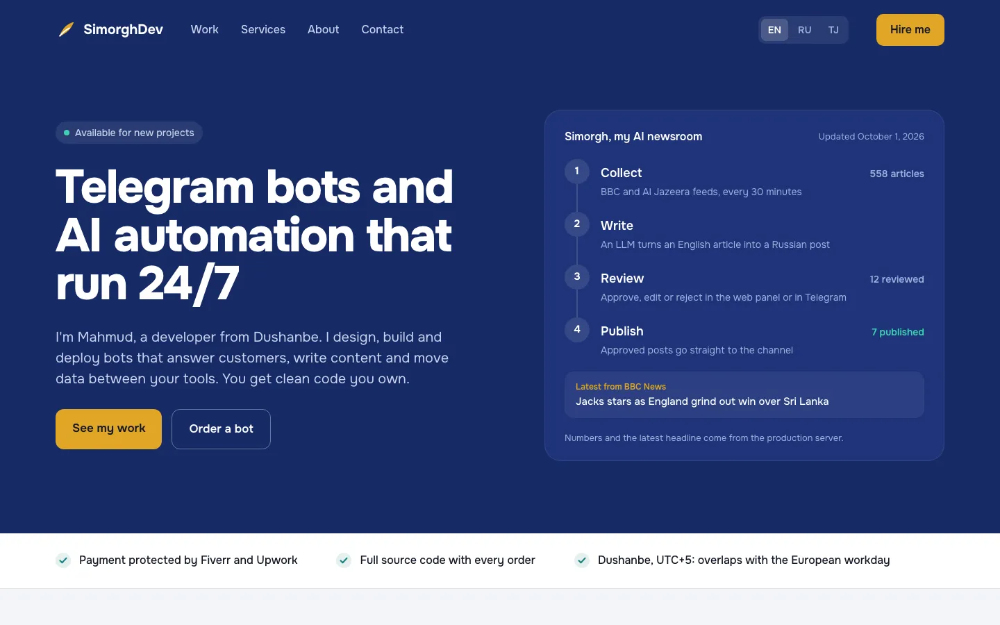

# SimorghDev portfolio

Portfolio of Mahmud Faiezov: Telegram bots and AI automation.



## Stack

Next.js 16 (App Router, static export) · TypeScript · Tailwind CSS 4 · Vitest · Playwright · Lighthouse CI · Cloudflare Pages

## Run locally

```bash
npm install
npm run dev          # http://localhost:3000
```

## Check

```bash
npm run typecheck && npm run lint && npm test
npm run build && npm run test:e2e
node scripts/check-js-budget.mjs
npx lhci autorun
```

## Structure

| Path | What |
|---|---|
| `app/` | routes: `(en)` for `/`, `[locale]` for `/ru/` and `/tj/` |
| `components/` | page sections |
| `content/` | links, projects, skills, prices, stats snapshot |
| `messages/` | EN / RU / TJ dictionaries |
| `lib/` | i18n and formatting helpers |
| `docs/` | architecture, decisions (ADR), specs and plans |

## Deploy

`npm run build` writes a static site to `out/`. Hosting on Cloudflare Pages is set up in the launch stage.

## License

Code: MIT. Texts and photos: all rights reserved. See [LICENSE](LICENSE).
